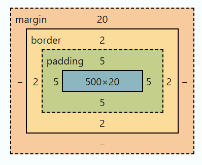

# **Tema 3: El Modelo de Caja en CSS**

## **1. Introducción al Modelo de Caja**
El **Modelo de Caja** es un concepto fundamental en CSS que describe cómo se representan y organizan los elementos en una página web. Cada elemento HTML se considera una caja rectangular que está compuesta por cuatro áreas principales:

1. **Contenido (Content):** El área donde se muestra el contenido del elemento, como texto o imágenes.
2. **Relleno (Padding):** Espacio entre el contenido y el borde del elemento.
3. **Borde (Border):** Línea que rodea el contenido y el relleno.
4. **Margen (Margin):** Espacio entre el borde del elemento y los elementos adyacentes.

Representación para un elemento con un contenido de 500px de ancho y 20px de alto, 5px de padding, 2px de borde y 20px de margen superior y 0px del resto de márgenes:



---

## **2. Partes del Modelo de Caja**
Cada caja en CSS sigue esta estructura:

```css
div {
    width: 200px;
    height: 100px;
    padding: 10px;
    border: 5px solid black;
    margin: 20px;
}
```

En este caso:
- **width** y **height** definen el tamaño del contenido.
- **padding** agrega un espacio interno alrededor del contenido.
- **border** crea un borde sólido negro de 5 píxeles.
- **margin** separa el elemento de los demás.

---

## **3. Cómo calcular el tamaño total de una caja**
El tamaño total de un elemento se calcula sumando:

```
Ancho total = width + padding izquierdo + padding derecho + border izquierdo + border derecho + margin izquierdo + margin derecho
```
```
Alto total  = height + padding superior + padding inferior + border superior + border inferior + margin superior + margin inferior
```

**Ejemplo:**
```css
div {
    width: 200px;
    height: 100px;
    padding: 10px;
    border: 5px solid black;
    margin: 20px;
}
```
El tamaño total sería:
- **Ancho total:** 200 + 10 + 10 + 5 + 5 + 20 + 20 = 270px
- **Alto total:** 100 + 10 + 10 + 5 + 5 + 20 + 20 = 170px

---

## **4. `box-sizing`: Control del cálculo de la caja**
Por defecto, CSS calcula el tamaño de los elementos sin incluir el borde y el padding. Sin embargo, con `box-sizing: border-box;`, el ancho y alto incluyen el padding y el borde.

```css
div {
    width: 200px;
    height: 100px;
    padding: 10px;
    border: 5px solid black;
    box-sizing: border-box;
}
```

Ahora, el ancho y el alto del elemento se mantienen en 200x100 píxeles, sin aumentar con el padding y el borde.

---

## **5. Propiedades de margen y padding**
### **Margen (`margin`)**
Define el espacio externo entre un elemento y los elementos adyacentes.
```css
div {
    margin: 20px; /* Aplica 20px a todos los lados */
}
```
Se puede definir individualmente:
```css
div {
    margin-top: 10px;
    margin-right: 20px;
    margin-bottom: 30px;
    margin-left: 40px;
}
```
También se puede usar el atajo:
```css
div {
    margin: 10px 20px 30px 40px; /* top right bottom left */
}
```

### **Relleno (`padding`)**
Similar a `margin`, pero define el espacio interno entre el contenido y el borde del elemento.
```css
div {
    padding: 15px;
}
```
Se pueden definir valores individuales:
```css
div {
    padding-top: 5px;
    padding-right: 10px;
    padding-bottom: 15px;
    padding-left: 20px;
}
```
o
```css
div {
    padding: 5px 10px 15px 20px; /* top right bottom left */
}
```

---

## **6. Colapso de márgenes**
Cuando dos elementos tienen márgenes superiores o inferiores consecutivos, se combinan en lugar de sumarse.

Ejemplo:
```css
div {
    margin-bottom: 20px;
}
p {
    margin-top: 30px;
}
```
En este caso, el margen resultante entre los dos elementos será de 30px, no 50px.

---

## **7. Buenas prácticas con el Modelo de Caja**
- Usar `box-sizing: border-box;` para evitar cálculos complicados de tamaño.
- Mantener una estructura clara con `margin` y `padding` bien definidos.
- Evitar márgenes negativos, ya que pueden causar problemas inesperados.
- Revisar el colapso de márgenes para evitar errores visuales.

---

En el próximo tema, exploraremos **las unidades de medida en CSS**, incluyendo píxeles, porcentajes, em y rem.
